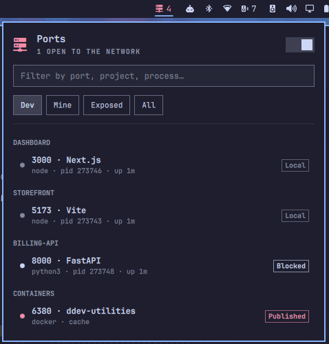

# Portside

An [Omarchy](https://omarchy.org/) bar plugin that lists the ports listening on
your machine. It sends a notification when a dev server starts, goes down, or
becomes reachable from the network. Before it calls a port exposed, it checks
UFW. It also flags Docker ports, because Docker's own rules skip UFW.



## Install

```bash
omarchy plugin add https://github.com/Saikomantisu/omarchy-portside.git --enable --yes
```

Plugins run unsandboxed inside `omarchy-shell`, so read the source first.

## Remove

```bash
omarchy plugin remove io.github.saikomantisu.portside --yes
```

This deletes the plugin folder and its settings. Portside stores nothing else.

## Requirements

Omarchy already ships these: `python3` 3.9 or newer, `ip`, `notify-send`,
`xdg-open`, `wl-copy`, `xdg-terminal-exec` and `uwsm-app`. You only need
`docker` or `podman` if you want container ports named. Portside needs no root.

## Use

Click the icon to open the panel. Click a row to open it in the browser, or
hover it to copy, watch or stop. Stopping always asks first. You'll find the
settings in the bar's widget settings.

```bash
omarchy-shell portside list | open <port> | stop <port> | toggle | refresh
```

## License

MIT
